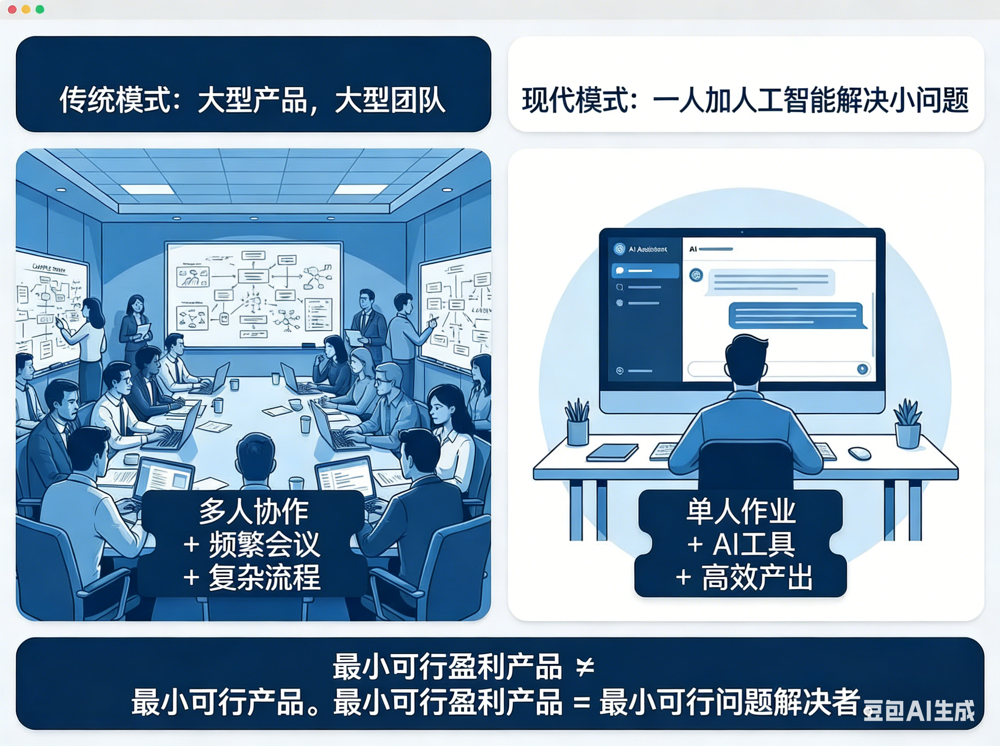
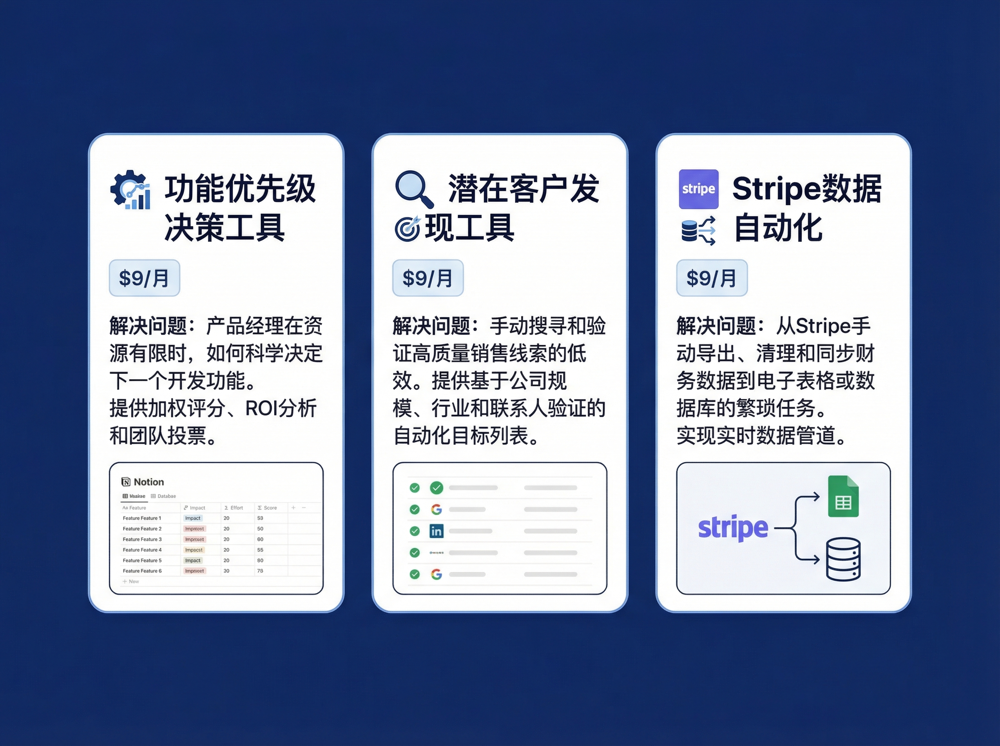
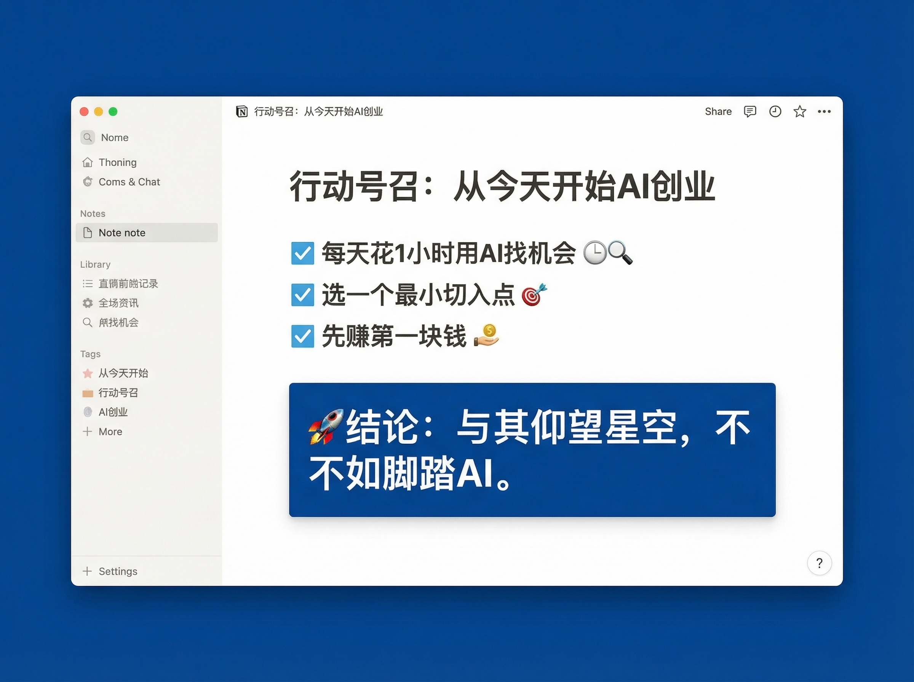

# 一个人也能做的AI创业：不做大产品，只赚小钱

---

你是否也有过这样的想法：

"我想创业，但没团队、没资源、没技术..."

"等产品做出来，黄花菜都凉了"

"还是算了吧，等攒够钱再说"

但我想告诉你：**AI时代，这些都不是问题了。**

过去，一个产品从0到1需要组建团队、融资烧钱、开发半年起步。现在，一个人加AI工具，几天就能验证一个想法。

这不是理论，而是一个正在发生的现实。

---

## 思维转变：从"做大"到"做小"

很多人对创业有误解——以为必须做一个"大产品"，仿佛做个小东西就很LOW。

但事实恰恰相反。

**MVP不是最小可行产品，是最小可赚钱产品。**

真正的创业者，不是追求"改变世界"，而是追求"解决一个问题，赚一些钱"。

硅谷知名投资人Paul Graham说过："做人们想要的东西。"

这句话听起来简单，但99%的人做错了——他们做的是"我覺得人们想要的东西"，而不是"人们真的想要的东西"。

怎么知道人们想要什么？

答案是：**去听用户的骂声。**

---

## AI加持：一个人 = 过去一个团队

用好AI工具，一个人可以完成过去一个团队的工作：

**Cursor/v0**：AI帮你写代码做前端，不需要雇程序员
**OpenClaw**：AI帮你做市场调研找机会，不需要雇分析师
**n8n**：AI帮你做自动化流程，不需要雇运营
**AI文案/图片工具**：AI帮你做内容，不需要雇设计师

香港有个独立开发者，用OpenClaw做了个"商业机会侦察机器人"。

每天自动扫全网，找用户抱怨，然后生成报告告诉用户：
- 什么机会值得做
- 怎么用AI快速验证
- 第一个1000美元怎么赚

一个人。没有团队。没有融资。

这在以前是不可想象的。

---

## 3个真实的小钱机会

我从Indie Hackers上抓了3个真实痛点，每个人都能做：

### 机会1：功能优先级决策工具 — $29/月

**痛点**：创始人花大量时间做"看起来很酷"的功能，但这些功能不解决核心问题。产品越来越复杂，用户还是不买单。

**现有方案**：自己瞎猜用户需要什么，或者花钱做用户调研（贵且慢）

**解法**：输入你的功能列表，AI分析哪些是"真需求"，哪些是"伪需求"，给出优先级排序。

**谁能做**：懂产品 + 会用AI的人

---

### 机会2：潜在客户发现工具 — $49/月

**痛点**：产品做出来了，但不知道客户在哪。冷启动太难，在Reddit/Twitter发帖总被当成广告删掉。

**现有方案**：自己手动找论坛发帖（累且容易被封），买广告（贵，ROI低）

**解法**：自动监控Reddit、Twitter、Indie Hackers等平台，找到正在抱怨你能解决的问题的人，推送给你。你去回复（不是广告，是帮忙）。

**谁能做**：会用API + 懂社交媒体的人

---

### 机会3：Stripe数据自动化 — $19/月

每次要看数据，都要**痛点**：登录Stripe，手动导出CSV，再导入Excel分析。重复劳动，浪费时间。

**现有方案**：手动导出（烦），用Stripe的高级分析功能（贵，$100+/月）

**解法**：自动从Stripe拉数据，生成可视化报表（收入趋势、退款率、客户留存），每天早上发到你邮箱/飞书。

**谁能做**：会用Stripe API + 会做图表的人

---

## 重点是：不需要你会编程

你只需要：
- 会用AI工具（ChatGPT、Claude、Gemini...）
- 懂一点自动化（n8n、Make、Zapier...）
- 有执行力

AI时代，会用AI本身就是一种技能。

---

## 行动号召

不需要辞职，不需要很多钱。

**从今天开始：**

1. 每天花1小时用AI找机会
2. 选一个最小切入点
3. 先赚第一块钱

与其仰望星空，不如脚踏"AI"。

---

## 发布信息

- **发布平台：** 公众号
- **发布时间：** 2026-03-08 21:45
- **发布方式：** Chrome CDP 自动化
- **发布状态：** 已保存到草稿箱
- **草稿箱链接：** https://mp.weixin.qq.com/cgi-bin/appmsg

*本文灵感来源：微信公众号「星空的后花园」*

*关注我，了解更多AI趋势洞察*

*发布时间：2026-03-08 21:45*
