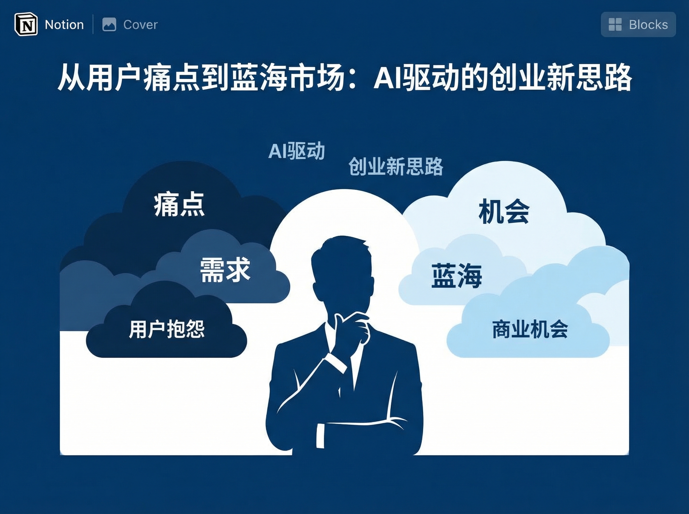
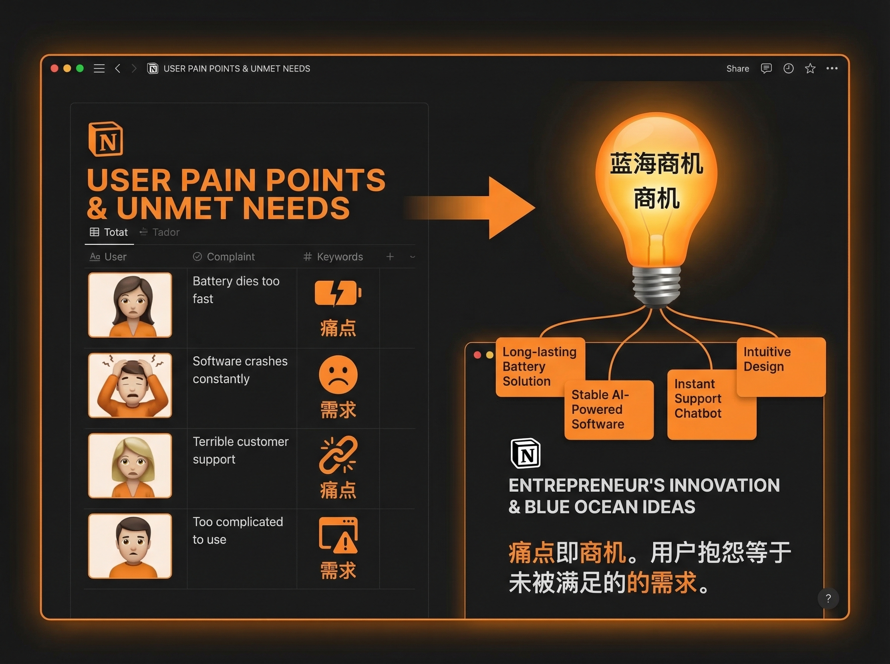
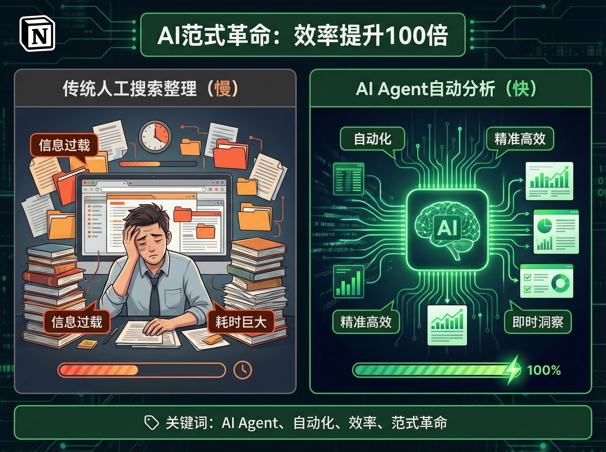
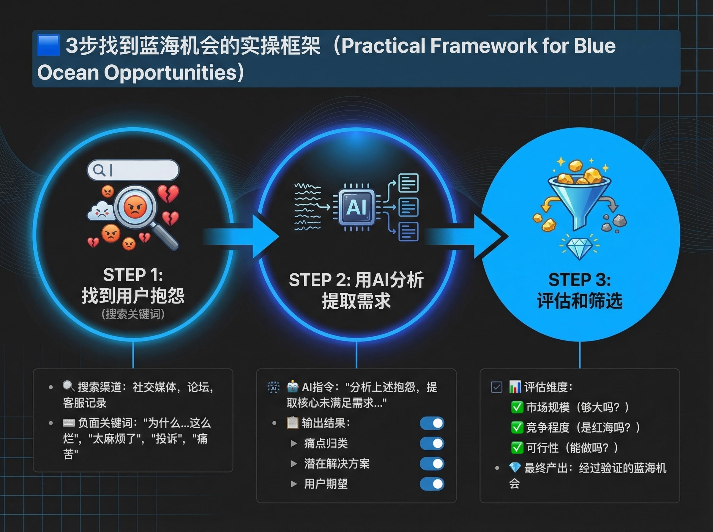
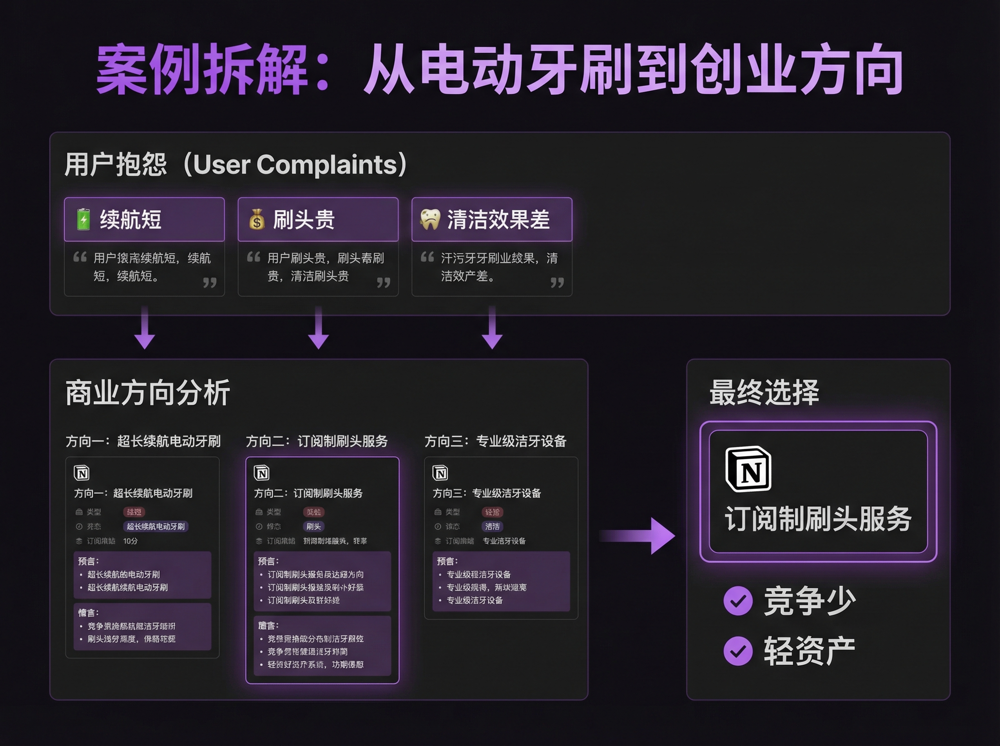
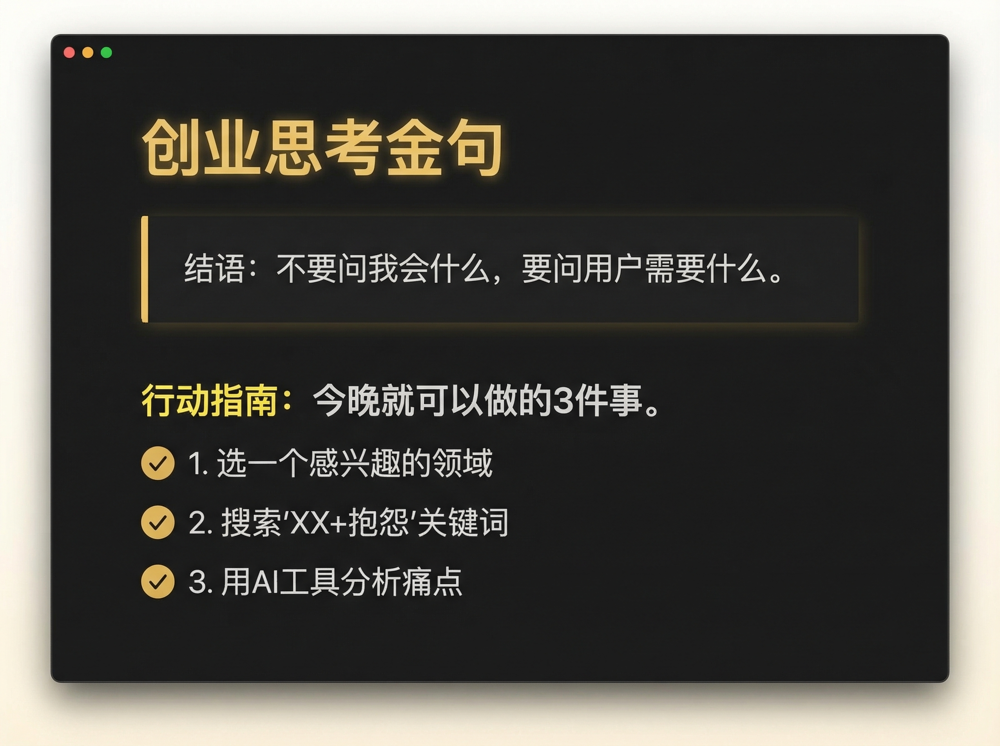

# 从用户痛点到蓝海市场：AI驱动的创业新思路

## 想象这样一个场景

你想创业，但不知道做什么。

大多数人的做法是：想一想自己会什么，然后去找市场。

这个方法最大的问题是什么？

**你在找"你能做的"，而不是"市场需要的"。**

但如果我告诉你，有一个反直觉的方法，能帮你找到真正有市场需求的商业机会呢？

**从用户的抱怨里找机会。**

用 AI 工具批量搜索用户的抱怨，从中发现竞争少的蓝海市场。

---



## 痛点即商机

为什么用户抱怨里藏着商业机会？

**用户抱怨 = 未被满足的需求。**

当一个人在网上抱怨某个产品时，他其实是在说："这个产品没有满足我的需求，如果有人能解决，我愿意付费。"

更反直觉的是，**抱怨越多的地方，往往竞争越少。**

因为大多数创业者喜欢追逐热点，喜欢"看起来很美"的赛道。那些用户抱怨多的领域，往往看起来"不性感"、"有争议"，所以竞争反而少。

举个例子。

假设你想在"电动牙刷"这个领域找机会。搜索"电动牙刷 抱怨"，你会发现：

- "续航太短，每次出差都要带充电器"
- "刷头太贵，换一次刷头够买半支新牙刷"
- "清洁效果不好，刷完还是感觉不干净"
- "震动太强，牙龈受不了"
- "操作太复杂，家里老人不会用"

每一个抱怨背后，都是未被满足的需求：

- 续航短 → 长续航电动牙刷
- 刷头贵 → 订阅制刷头服务
- 清洁效果差 → 专业级家用洁牙设备
- 震动强 → 敏感牙龈专用款
- 操作复杂 → 老人专用简化款

这些方向，可能没有"智能电动牙刷"听起来那么酷，但每一个都是真实存在的市场需求。

传统方式的问题是什么？**效率太低。**

手动搜索、整理、分析，1小时可能只能处理20-30条信息。

---



## AI 带来的范式革命

最近看到一个案例：用 OpenClaw（一个开源的 AI Agent 框架）构建了一个"商机发现 Agent"。

这个 Agent 能自动搜索社交媒体、评论、论坛中的用户抱怨，然后用 AI 分析这些抱怨，提取高频痛点，最后评估哪些痛点有商业价值。

**效率至少提升了 100 倍。**

原来需要人工花 1 天时间搜索整理的信息，AI 可以在几分钟内完成分析，而且覆盖面更广，更客观。

这带来的是一个范式革命：

- 从"人找信息"到"AI 找信息"
- 从"随机发现"到"系统性搜索"
- 从"手工整理"到"自动化分析"

---



## 实操框架：3步找到蓝海机会

即使你不使用 OpenClaw 这种复杂的工具，你也可以用 ChatGPT、Claude 等通用 AI 工具，构建一个简化版的"商机发现工作流"。

### 步骤1：找到用户抱怨

**搜索关键词公式：产品名 + 抱怨/痛点/问题**

数据来源包括：微博、小红书、知乎、淘宝差评、京东差评、豆瓣、贴吧。

**技巧：**

- 搜索时间限定在最近 3 个月
- 重点看长评论，往往包含更多细节
- 关注多次出现的痛点

### 步骤2：用 AI 分析提取需求

把收集到的评论（至少 50 条）喂给 AI，让它做以下分析：

```
请分析以下 50 条用户抱怨，帮我：

1. 总结出前 5 个高频痛点
2. 每个痛点的需求强度（高/中/低）
3. 这些痛点背后的真实需求是什么
4. 如果要解决这些痛点，可能的商业方向是什么
```

### 步骤3：评估和筛选

拿到 AI 的分析结果后，做 3 个维度的评估：

**维度1：市场规模**

- 这个痛点影响多少人？
- 他们愿意付费吗？

**维度2：竞争程度**

- 目前有没有产品在解决这个痛点？
- 如果有，你能否做得更好？

**维度3：个人能力匹配度**

- 这个方向需要什么能力？
- 你有这些能力吗？能学到或找到合作伙伴吗？

只有这 3 个维度都通过，才值得深入。

---



## 案例拆解：从"电动牙刷"到创业方向

用一个具体案例，把整个流程演示一遍。

**第1步：搜索"电动牙刷 抱怨"**

打开小红书、知乎、淘宝差评，收集 100 条用户抱怨。

**第2步：用 AI 分析**

AI 输出高频痛点 Top 3：

1. **续航不足**（需求强度：高）
   - 可能方向：超长续航电动牙刷

2. **刷头太贵**（需求强度：中）
   - 可能方向：订阅制刷头服务

3. **清洁效果不佳**（需求强度：高）
   - 可能方向：专业级家用洁牙设备

**第3步：评估和筛选**

**方向1：超长续航电动牙刷** - 竞争中等，可行但需差异化
**方向2：订阅制刷头服务** - 竞争少，轻资产，适合创业
**方向3：专业级家用洁牙设备** - 门槛太高，不适合个人

**最终选择：方向2（订阅制刷头服务）**

为什么？

- 市场有需求（刷头贵是共性问题）
- 竞争少（很少有人专门做这个）
- 可行性高（不需要研发产品，只需要供应链和运营）

---

## 为什么大多数人找不到方向？

"从用户痛点出发"这个思路本身并不新鲜。

但大多数人知道，却做不到。

因为有几个思维误区：

### 误区1：从自己的能力出发，而不是从市场需求出发

**传统创业思路：** 我会什么 → 做什么 → 找用户
**新思路：** 用户痛什么 → 学什么/找谁做 → 做什么

第一个思路的问题在于：你会的东西，市场可能不需要。

### 误区2：只看成功案例，不看用户痛点

很多人喜欢研究成功案例："那个品牌是怎么做起来的？"

但成功案例往往是事后总结，有很多幸存者偏差。更重要的是，成功案例往往有时代红利、资源优势，你很难复制。

相比之下，**用户痛点是真实存在的，是永恒的。**

### 误区3：用"我认为"替代"用户需要"

很多人创业的起点是："我认为用户需要这个。"

但问题是，"你认为"不重要，**用户真的需要才重要。**

---

## 行动指南：今晚就可以尝试

看完这篇文章，不要只是"看懂了"，要真正去尝试。

**今晚就可以做的 3 件事：**

1. **选一个你感兴趣的领域**
   - 你最近想买的产品
   - 你工作中遇到的痛点
   - 你身边朋友常抱怨的事

2. **搜索"XX + 抱怨"**
   - 打开小红书、知乎、淘宝
   - 收集至少 50 条用户抱怨

3. **用 AI 分析**
   - 把 50 条抱怨喂给 ChatGPT 或 Claude
   - 让它总结高频痛点、提取需求、给出方向

**做完这 3 步，你可能会发现一些你从未想到的机会。**

---



## 结语

**真正的机会不在你擅长什么，而在于用户需要什么。**

AI 时代，找方向的能力比做方向的能力更重要。

因为一旦你找到了正确的方向，做起来就相对简单了。AI 工具可以帮你做产品、做营销、做运营。

但如果方向错了，再好的执行力也救不了你。

所以，从今天开始，改变你的思路：

**不要问"我会什么"，要问"用户需要什么"。**

---

*本文作者：AI 创业者*
*关注我，了解更多 AI 创业实战经验*
